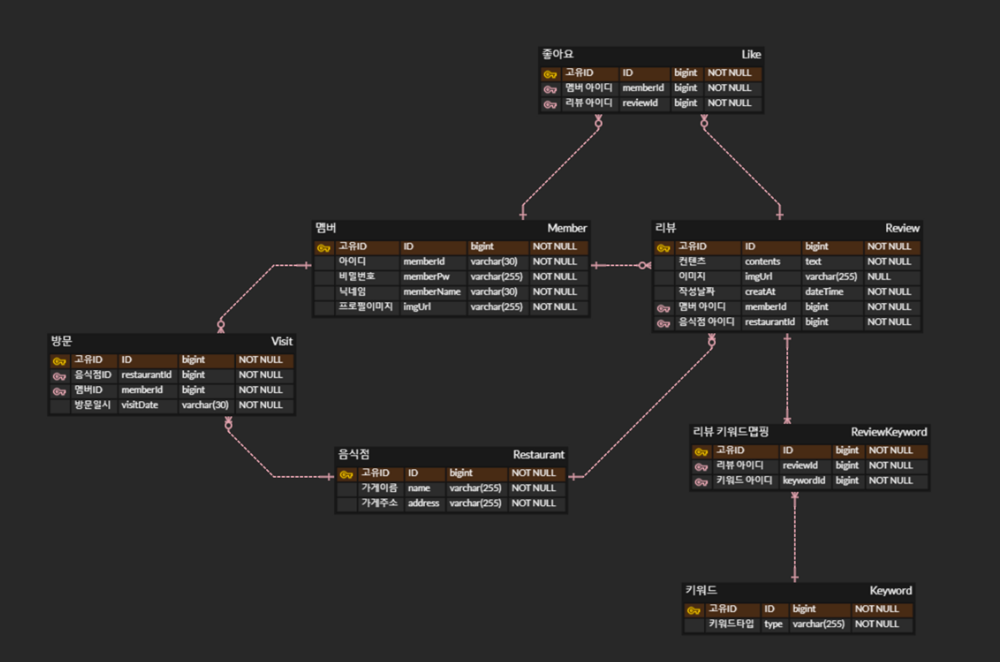
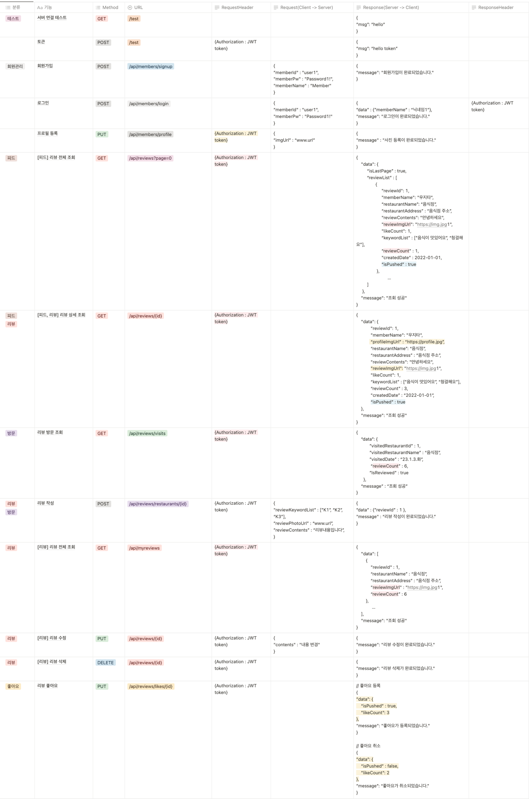

## 🍀 네이버 MyPlace 클론코딩

네이버 MyPlace 클론코딩입니다.

방문했던 음식점에 대한 리뷰를 작성하고, 다른 사람들이 남긴 리뷰를 확인할 수 있습니다.

마음에 드는 리뷰는 좋아요를 표시해보세요.

### 📆 개발기간

2023.03.03 ~ 03.09

### 🛠️ 기술스택

- FE
  - JavaScript
  - React
- BE
  - Java
  - Spring
  - MySQL

### 💡 구현기능

- **회원가입**
  - **유효성 검사**
    - **아이디 : 5~20자의 영문 소문자, 숫자와 특수기호(_),(-)만 사용 가능합니다.**
    - **비밀번호 : 8~16자 영문 대 소문자, 숫자, 특수문자를 사용하세요.**
    - **닉네임 : 2~20자의 한글, 영문 대 소문자, 숫자를 사용하세요.**
    - **입력안한 경우 : 필수 정보입니다.**
- **로그인**
  - **ID, PW 일치하지 않는 경우 : 다시 로그인해 주세요.**
- **리뷰 CRUD**
  - **리뷰 작성, 수정, 삭제가 가능하다.**
  - **리뷰 등록 시, 이미지를 함께 올릴 수 있다.**
  - **리뷰 수정, 삭제는 작성자만 가능하다.**
- **피드 탭**
  - **모든 리뷰를 조회할 수 있다.**
  - **무한 스크롤**
- **방문 탭**
  - **내가 방문했던 음식점을 확인할 수 있다.**
  - **방문했던 음식점의 리뷰를 작성할 수 있다.**
- **리뷰 탭**
  - **내가 작성한 리뷰를 볼 수 있다.**
- **좋아요 기능**
  - **마음에 드는 리뷰에 좋아요를 누를 수 있다.**

### 🎥 시연 영상 

- **링크** : https://www.youtube.com/watch?v=RHZpohkQ_70&t=1s

---

### 📋 와이어 프레임

[와이어프레임.pdf](document/와이어프레임.pdf)

---

### 📄 ERD

---

### 📜 API 문서

---

### ✋ 조원 정보

| 이름 | 구분 | 업무파트                                | Github 주소 |
| --- | --- |-------------------------------------| --- |
| 김근호 | 백엔드(spring) | 피드, 방문, 리뷰 데이터 조회 구현  상세 리뷰 조회 구현 | https://github.com/GEUNHOKIM |
| 김도연 | 백엔드(spring) | 회원가입, 로그인, 시큐리티 구현 음식점, 방문 데이터 등 sample data 작성 리뷰 작성 구현 | https://github.com/dev-dykim |
| 김진원 | 백엔드(spring) | 이미지 업로드 구현 리뷰 수정, 삭제 구현 좋아요 기능 구현 서버 배포 | https://github.com/skwwnl |
| 최승호 | 프론트엔드(React) | 로그인 회원가입 메인 페이지 피드, 방문, 리뷰 조회 무한스크롤 | https://github.com/ |
| 한지윤A | 프론트엔드(React) | 리뷰 상세조회 리뷰 수정 리뷰 삭제 좋아요 기능 | https://github.com/JellyKingdom |
| 김찬희 | 프론트엔드(React) | 리뷰 작성 리뷰 수정 리뷰 삭제 카테고리 체크 이미지 업로드 |  |

---

### 💥 트러블 슈팅
- **JPA 연관관계 문제**
  - **문제** : IntelliJ에서 MySQL을 통해서 테이블과 컬럼을 생성해서 데이터를 넣을때 원치 않았던 테이블이 생성이 되었다. 
  - **시도** : 테이블간의 연관관계에 대한 엔티티 선언 부분을 다시 확인 해 보기도 하고, 수동으로 드랍을 해보기도 하고, 에러 코드를 천천히 확인 해보면서 해결 시도를 해보았습니다.
  - **원인** : 양방향 연관관계에 대해서 단방향으로만 생각하고 @mappedBy 어노테이션을 안 걸어주었습니다. 그로 인해서 중간 맵핑 테이블이 자동으로 생성이 되었습니다.
  - **느낀점** : 처음에 ERD를 작성할 때 신중하게 작성한다고 신경을 썼지만, 좀 더 신중히 확인을 하고 엔티티를 만들어 줄 때도 코드를 한번 더 확인을 해야겠다.

